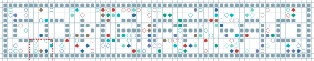

# Collaborative Priority Planning (CPP) for CoMAPF-AD

Code for the **Collaborative Multi-Agent Path Finding with Action Durations (CoMAPF-AD)** framework and the **Cooperative Priority Planning (CPP)** algorithm.

The core pathfinding engine is implemented in **C++** for efficiency and wrapped with **Pybind11** for flexible Python integration. It supports complex cooperative behaviors (pickup, delivery, co-work) and action duration constraints.

Please refer to the paper for more details:

**[Insert Your Paper Title Here]**  
[Li, Z., Li, B., Wu, W., & Li, D.]  
[Scalable Priority Planning for Collaborative Multi-Agent Synchronization and Routing with Action Durations], [2026].  
[Link to arXiv or PDF]

This work extends the standard Co-MAPF framework by introducing a prioritized planning approach with dynamic time-window adjustment and heatmap-based congestion avoidance, specifically optimized for scenarios with realistic operation/interaction duration constraints.

## Visualization (Demo & Scalability)
### 1. CPP Algorithm Demo (Collaborative Task Execution)
The SVG below demonstrates the core collaborative behaviors of CPP (pickup, delivery, co-work) with action duration constraints on a sample map:  
<div align="center">
  
</div>
- **Key Features Shown**: Alpha/Beta agent synchronization, co-work duration enforcement, pickup/delivery time constraints, and collision-free path planning.
- **File Path**: `assets/demo.svg`

### 2. CPP Scalability on Large Empty Map （32*32， 280 agents）
The SVG below illustrates CPP's performance on a large-scale empty map (100x100 grid) with 50+ agents, showcasing its scalability and congestion avoidance capability:  
<div align="center">
  
</div>
- **Key Features Shown**: Low collision rate, optimized makespan, heatmap-guided congestion avoidance, and dynamic time-window adjustment for large agent clusters.
- **File Path**: `assets/large_empty_map.svg`

---


---

## Dependencies

This project uses a hybrid Python/C++ environment.

- Python 3.8+
- C++17 Compiler  
  - MSVC (Windows)  
  - GCC/Clang (Linux/macOS)
- Pybind11
- NumPy
- ToolboxRegistry
---

## Installation

Clone the repository:

```bash
git clone https://github.com/WatermelonZC/CoMAPF-with-action-durations
cd CoMAPF-AD-CPP
```

### Install Python Requirements
```bash
pip install -r requirements.txt
```
### Compile the C++ Core
The low-level planner is implemented in C++ and compiled as a Python extension module (planner_lib.so or planner_lib.pyd).
```bash
python setup.py install
```

## Usage
To run the code using the default settings on a sample map (random generation):
```bash
python run_solver.py
```
To run with specific parameters, for example:
```bash
python run_solver.py --map maps/random-32-32-20.map --num_tasks 10 --objective Makespan --use_heatmap --heatmap_weight 5.0
```
To run with a custom task file (reproducible scenario):
```bash
python run_solver.py --map maps/random-32-32-20.map --task_file my_tasks.txt --heuristic LFF
```
| Flag                             | Description                                                                           |
| -------------------------------- | ------------------------------------------------------------------------------------- |
| `--map`                          | Path to the MAPF map file (MovingAI format).                                          |
| `--task_file`                    | Path to a custom task file (.txt). Overrides --num_tasks..                            |
| `--num_tasks`                    | Number of task pairs to randomly generate (only if --task_file is not set).           |
| `--objective`                    | Optimization objective: `Makespan` or `SoC`.                                          |
| `--heuristic`                    | Priority rule: `LPF` (Longest Path First), `LFF` (Least Flexible First), or `Random`. |
| `--time_window`                  | Time-window size for Fixed-T mode.                                                    |
| `--use_heatmap` / `--no_heatmap` | Enable/disable congestion heatmap guidance.                                           |
| `--heatmap_weight`               | Penalty weight for traversing high-congestion cells.                                  |
| `--debug`                        | Enable verbose logging.                                                               |

## Custom Task Configuration
To run experiments with specific start/goal locations and durations, you can provide a .txt file via --task_file.
### Format:
 Each line represents one task (a pair of Alpha/Beta agents) containing 12 integers separated by spaces:

> ID  Alpha_Start(r,c)  Alpha_Goal(r,c)  Beta_Start(r,c)  Beta_Pickup(r,c)  Dur_CoWork  Dur_Pick  Dur_Del

Where:

- A_Sr, A_Sc: Alpha start

- A_Gr, A_Gc: Alpha goal

- B_Sr, B_Sc: Beta start

- B_Pr, B_Pc: Beta pickup

- CoW: Co-work duration

- Pick, Del: Pickup & delivery durations

### Example
``` Plaintext
>  ID  A_Sr A_Sc  A_Gr A_Gc  B_Sr B_Sc  B_Pr B_Pc  CoW Pick Del
>  0     1    1     5    5     10   10    5    6     3   2    2
>  1     2    2     8    8     12   12    8    9     2   1    1
```
## Benchmarks
Standard MAPF benchmarks are taken from [the Nathan Sturtevant's Moving AI Lab](https://movingai.com/benchmarks/mapf.html). To reproduce our experimental results:
You can download more benchmarks from there and put them in the maps/ folder.

## Acknowledgements
Thanks to https://github.com/CRL-Technion/Cooperative-MAPF (foundational CoMAPF background) – We extend it with action duration constraints, congestion-guided priority queues, and Time-Constrained A* with synchronization windows (key contributions of our work)..
